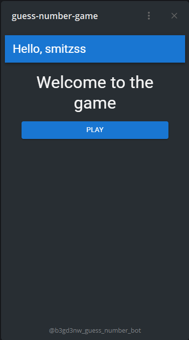
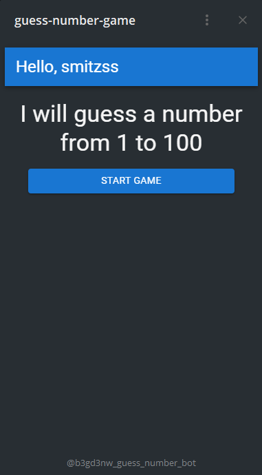
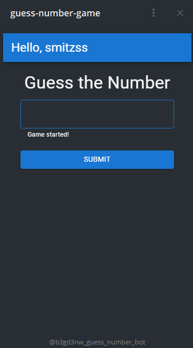
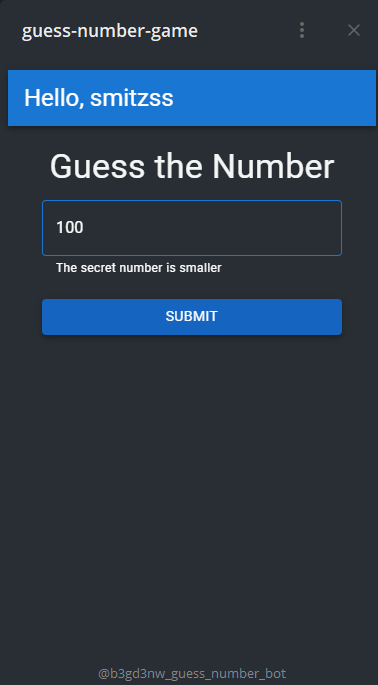
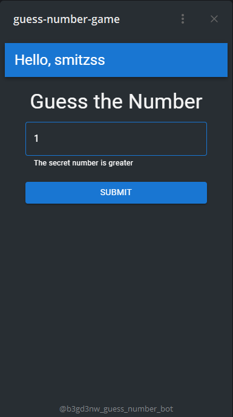
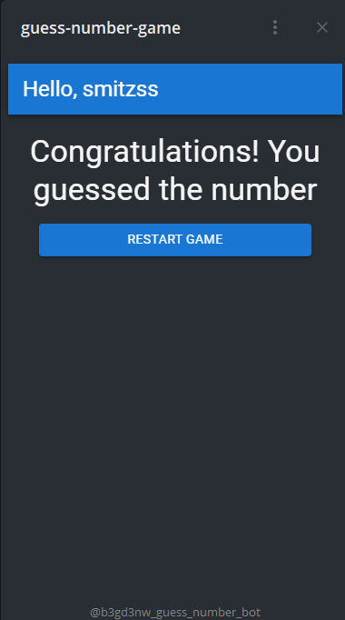

# Guess Number Game

## Description

This is a mini-application for the game "Guess Number Game" that can be used through WebView in Telegram bots.

## Instructions for launching

First of all, create a Telegram bot and get your token.

### Client part (React)

1. Go to directory `guess-number-game/client`.
2. Install dependencies:
 
    npm install

3. Create .env file such as example-env.   
4. Launch client part:

    npm start

### Create a tunnel for Telegram bot

1. Make sure you have Ngrok installed globally.
2. Open a terminal and copy the following line there "ngrok http 3000 --request-header-add='host: localhost'". This is so that your Telegram mini-app can open your web view. It will not be able to open localhost.
3. Save the public link that Ngrok gave you, we will need it later. Example link: https://example.ngrok-free.app.

### Server part (NodeJS)

1. Go to directory `guess-number-game/server`.
2. Install dependencies:
 
    npm install

3. Create .env file such as example-env.  
4. Launch server part:

    npm start

### Mini-App screenshots

